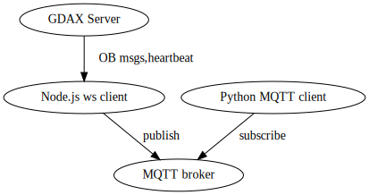

# gdax_OB
playing around with python/node for processing data from exchange over websockets

Overview of architecture:

Current MQTT broker: Mosca

GDAX API reference: https://docs.gdax.com/

Steps to run:

1. *bin/run_broker.sh* starts local Mosca instance.
2. *mqtt_serv.js* will attempt to connect to the GDAX server and subscribe to OB updates, publishing them to Mosca.
3. *gdax_trading/connect.py* will subscribe to Mosca and print updates to cmd line.

TODO:
1. Add QoS guarantees to MQTT pub/sub (0,1,2)
2. Implement order book logic in Python client
3. Implement logic to publish to certain topic in Node.js client (based on message received from GDAX). Right now 
it's all being published to the same topic.
